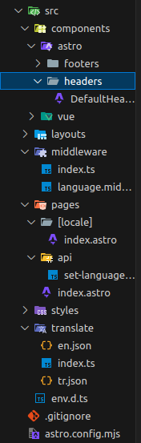

<div id="top"></div>

[![Contributors][contributors-shield]][contributors-url]
[![Forks][forks-shield]][forks-url]
[![Stargazers][stars-shield]][stars-url]
[![Issues][issues-shield]][issues-url]
[![MIT License][license-shield]][license-url]
[![LinkedIn][linkedin-shield]][linkedin-url]

<!-- PROJECT LOGO -->
<br />
<div align="center">
<h3 align="center">Astro Internalization With Dynamic Routing</h3>
</div>

<!-- TABLE OF CONTENTS -->
<details>
  <summary>Table of Contents</summary>
  <ol>
    <li>
      <a href="#about-the-project">About The Project</a>
      <ul>
        <li><a href="#built-with">Built With</a></li>
      </ul>
    </li>
    <li>
      <a href="#getting-started">How To Implement</a>
      <ul>
        <li><a href="#installation">Installation</a></li>
        <li><a href="#project-structure">Project Structure</a></li>
        <li><a href="#translation-files">Translation Files</a></li>
        <li><a href="#set-language-endpoint">Set Language Endpoint</a></li>
        <li><a href="#language-middleware">Language Middleware</a></li>
        <li><a href="#disable-prerendering">Disable Prerendering</a></li>
        <li><a href="#add-dynamic-routing">Add Dynamic Routing</a></li>
        <li><a href="#add-components">Add Components</a></li>
        <li><a href="#call-set-language-endpoint">Call Set Language Endpoint</a></li>
        <li><a href="#final">Final</a></li>
      </ul>
    </li>
    <li><a href="#license">License</a></li>
    <li><a href="#contact">Contact</a></li>
    <li><a href="#resources">Resources</a></li>
  </ol>
</details>

<!-- ABOUT THE PROJECT -->

## About The Project

This project demonstrates an alternative approach to internationalization in Astro using dynamic routing and cookies. While disabling prerendering is not generally recommended, it is necessary on pages that rely on cookies for language detection. This method also doesn't prevent use of alternative translation methods.

You can also check libraries like [astro-i18next](https://github.com/yassinedoghri/astro-i18next), [paraglide](https://inlang.com/m/gerre34r/library-inlang-paraglideJs/astro).

<p align="right">(<a href="#top">back to top</a>)</p>

### Built With

- [Astro](https://nextjs.org/)
- [Vue (Optional)](https://vuejs.org/)

<p align="right">(<a href="#top">back to top</a>)</p>

<!-- GETTING STARTED -->

## How To Implement

### Installation

1. Clone the repo
   ```sh
   git clone https://github.com/white-hare/astro-internalization-with-dynamic-routing.git
   ```
2. Install NPM packages
   ```sh
   npm install
   ```

### Project Structure



### Configure Astro

First lets start with configuration. We have to define i18n settings. I used Turkish and English languages for my project and default locale for my website was Turkish. Also for this project Turkish language have been designated as fallback language.

Routing is set to manual. While options like _prefixDefaultLocale are available, manual routing combined with middleware is easier to manage in this setup.

astro.config.mjs

```js
import { defineConfig } from "astro/config";
import vue from "@astrojs/vue";
import tailwind from "@astrojs/tailwind";

// https://astro.build/config
export default defineConfig({
  i18n: {
    locales: ["tr", "en"],
    defaultLocale: "tr",
    fallback: {
      en: "tr",
    },
    routing: "manual",
  },
  integrations: [
    vue(),
    tailwind({
      applyBaseStyles: false,
    }),
  ],
});
```

### Translation Files

After some configuration we have to create our translation methods and files. The functions are straightforward. We get translations from json files and from the url we decide which language to use.

src/translate/index.ts

```ts
import tr from "./tr.json";
import en from "./en.json";

export const supportedLangues = ["en", "tr"];
export const defaultLang = "tr";

export const translations = {
  en,
  tr,
} as const;

export function getLangFromUrl(url: URL) {
  const lang = url.pathname.split("/").at(1)!;
  if (lang in translations) return lang as keyof typeof translations;
  return defaultLang;
}

function useTranslations(lang: keyof typeof translations) {
  return function t(key: keyof (typeof translations)[typeof defaultLang]) {
    return key in translations[lang]
      ? (translations[lang] as any)[key]
      : translations[defaultLang][key];
  };
}

export function getTranslation(url: URL) {
  const lang = getLangFromUrl(url);
  return useTranslations(lang);
}
```

src/translate/en.json

```json
{
  "hello": "Hello world"
}
```

### Set Language Endpoint

To hold user language preference I used cookies. Create an endpoint to set language cookie.

src/pages/api/set-language.ts

```ts
import type { APIRoute } from "astro";

export const prerender = false;

export const POST: APIRoute = async ({ cookies, request }) => {
  const language = await request.text();

  cookies.set("language", language, {
    httpOnly: true,
    sameSite: "strict",
    path: "/",
  });

  return new Response("", { status: 200 });
};
```

### Language Middleware

The middleware determines which endpoint the user should be redirected to. First we check language cookie to find if user has set a language. If cookie is _undefined_ than we check preferredLocale from the request. If both _language cookie_ and _preferredLocale_ is _undefined_ user will be redirected to default language.

You should also not interrupt the requests that are not require language redirection (Like API request, asset requests etc.). So we added _ignorPath_ function.

src/middleware/index.ts

```ts
import { sequence } from "astro:middleware";
import { languageMiddleware } from "./language.middleware";

export const onRequest = sequence(languageMiddleware);
```

src/middleware/language.middleware.ts

```ts
import { defineMiddleware } from "astro:middleware";
import { redirectToDefaultLocale } from "astro:i18n"; // function available with `manual` routing
import { supportedLangues } from "../translate";

export const languageMiddleware = defineMiddleware((ctx, next) => {
  const pathName = ctx.url.pathname;

  if (ignorePath(pathName)) {
    return next();
  }

  let cookieLang = ctx.cookies.get("language")?.value;

  if (!cookieLang && ctx.preferredLocale) {
    cookieLang = ctx.preferredLocale;
  }

  if (cookieLang && supportedLangues.includes(cookieLang)) {
    return ctx.redirect(`/${cookieLang}/${pathName}`, 302);
  }

  return redirectToDefaultLocale(ctx, 302);
});

function ignorePath(pathName: string) {
  const ignoredPaths = [
    ...supportedLangues.map((lang) => `/${lang}`),
    "/api",
    "/assets",
    "/static",
    "/.",
  ];

  return ignoredPaths.some((ignoredPath) => pathName.startsWith(ignoredPath));
}
```

### Disable Prerendering

You have to disable prerending in pages that you want to get language preference from cookies.

src/pages/index.astro

```astro
---
export const prerender = false;
---
```

### Add Dynamic Routing

Finally we have to add dynamic routing for creating multiple versions of pages. Create a _[locale]_ folder under the pages and add your other pages that requires translation.

src/pages/[locale]/index.astro

```astro
---
import Layout from "@pw/layouts/Layout.astro";

export const prerender = false;

export async function getStaticPaths() {
  return [{ params: { locale: "en" } }, { params: { locale: "tr" } }];
}
---

<Layout title="Mete ARSLAN" />
```

### Add Components

I also added simple _Layout.astro_ component for this project. There is a default slot for rendering page content and named slots for header, footer components.

src/layouts/Layout.astro

```astro
---
import DefaultFooter from "@pw/components/astro/footers/DefaultFooter.astro";
import DefaultHeader from "@pw/components/astro/headers/DefaultHeader.astro";
import "@pw/styles/main.scss";

interface Props {
  title: string;
}

const { title } = Astro.props;
---

<!doctype html>
<html lang="en">
  <head>
    <meta charset="UTF-8" />
    <meta name="description" content="Astro description" />
    <meta name="viewport" content="width=device-width" />
    <link rel="icon" type="image/svg+xml" href="/favicon.svg" />
    <meta name="generator" content={Astro.generator} />
    <title>{title}</title>
  </head>
  <body>
    <header>
      <slot name="header">
        <DefaultHeader />
      </slot>
    </header>
    <main>
      <slot />
    </main>
    <footer>
      <slot name="footer">
        <DefaultFooter />
      </slot>
    </footer>
  </body>
</html>
```

To get translation call getTranslation function that we have created and give page's url to it. For this example I also passed _targetLanguage_ as a parameter to a vue component for being able to swap between the languages. You can also use other frameworks or simply add inline javascript to Astro components.

src/components/astro/headers/DefaultHeader.astro

```astro
---
import { LanguageSwapButton } from "@pw/vue-components";
import { getTranslation } from "@pw/translate";

const translate = getTranslation(Astro.url);

const currentLanguage =
  Astro.cookies.get("language")?.value || Astro.preferredLocale || "tr"; // Default to "tr" if cookie is not set
const targetLanguage = currentLanguage === "en" ? "tr" : "en";
---

<div>
  <LanguageSwapButton client:load targetLanguage={targetLanguage}>
    <pre>{translate('hello')}</pre>
  </LanguageSwapButton>
</div>
```

### Call Set Language Endpoint

To change the language, send a request to */api/set-language*.


src/components/vue/buttons/LanguageSwapButton.vue

```vue
<script lang="ts" setup>
import Button from "../shadcn/buttons/Button.vue";

const { targetLanguage } = defineProps({
  targetLanguage: {
    type: String,
    required: true,
  },
});

async function onClick() {
  await fetch(`/api/set-language`, {
    method: "POST",
    headers: { "Content-Type": "application/text" },
    body: targetLanguage,
  });

  window.location.href = "/" + targetLanguage;
}
</script>

<template>
  <Button variant="outline" size="sm" @click="onClick()">
    <slot />
  </Button>
</template>
```

<p align="right">(<a href="#top">back to top</a>)</p>

<!-- LICENSE -->

## License

Distributed under the MIT License. See `LICENSE.txt` for more information.

<p align="right">(<a href="#top">back to top</a>)</p>

<!-- CONTACT -->

## Contact

Mete ARSLAN - mete.arslan9@hotmail.com

Project Link: [https://github.com/white-hare/astro-internalization-with-dynamic-routing](https://github.com/white-hare/astro-internalization-with-dynamic-routing)

<p align="right">(<a href="#top">back to top</a>)</p>

<!-- ACKNOWLEDGMENTS -->

## Resources

- [Internationalization (i18n) in Astro 5 (Paul Pietzko)](https://medium.com/@paul.pietzko/internationalization-i18n-in-astro-5-78281827d4b4)
- [Creating dynamic route language for i18n in Astro Build (Alan Pazetto) ](https://dev.to/alancpazetto/creating-dynamic-route-language-for-i18n-in-astro-build-2iim)
- [Internationalization (i18n) Routing](https://docs.astro.build/en/guides/internationalization/)

<p align="right">(<a href="#top">back to top</a>)</p>

<!-- MARKDOWN LINKS & IMAGES -->
<!-- https://www.markdownguide.org/basic-syntax/#reference-style-links -->

[contributors-shield]: https://img.shields.io/github/contributors/white-hare/astro-internalization-with-dynamic-routing.svg?style=for-the-badge
[contributors-url]: https://github.com/white-hare/astro-internalization-with-dynamic-routing/graphs/contributors
[forks-shield]: https://img.shields.io/github/forks/white-hare/astro-internalization-with-dynamic-routing.svg?style=for-the-badge
[forks-url]: https://github.com/white-hare/astro-internalization-with-dynamic-routing/network/members
[stars-shield]: https://img.shields.io/github/stars/white-hare/astro-internalization-with-dynamic-routing.svg?style=for-the-badge
[stars-url]: https://github.com/white-hare/astro-internalization-with-dynamic-routing/stargazers
[issues-shield]: https://img.shields.io/github/issues/white-hare/astro-internalization-with-dynamic-routing.svg?style=for-the-badge
[issues-url]: https://github.com/white-hare/astro-internalization-with-dynamic-routing/issues
[license-shield]: https://img.shields.io/github/license/white-hare/astro-internalization-with-dynamic-routing.svg?style=for-the-badge
[license-url]: https://github.com/white-hare/astro-internalization-with-dynamic-routing/blob/master/LICENSE.txt
[linkedin-shield]: https://img.shields.io/badLinkedInge/--black.svg?style=for-the-badge&logo=linkedin&colorB=555
[linkedin-url]: https://tr.linkedin.com/in/metearslan
